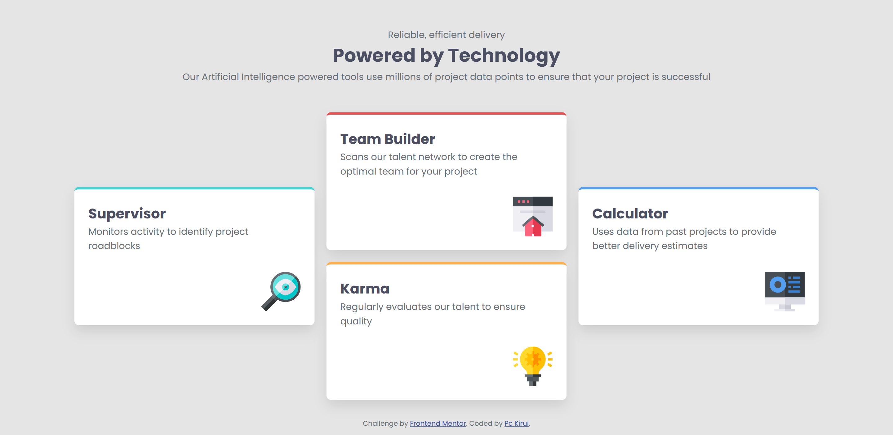
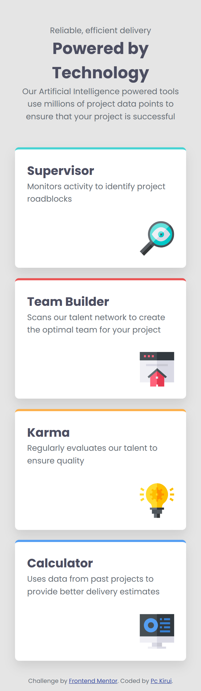

# Frontend Mentor - Four card feature section solution

This is a solution to the [Four card feature section challenge on Frontend Mentor](https://www.frontendmentor.io/challenges/four-card-feature-section-weK1eFYK). Frontend Mentor challenges help you improve your coding skills by building realistic projects.

## Table of contents

- [Overview](#overview)
  - [The challenge](#the-challenge)
  - [Screenshot](#screenshot)
  - [Links](#links)
- [My process](#my-process)
  - [Built with](#built-with)
  - [What I learned](#what-i-learned)
  - [Continued development](#continued-development)
  - [Useful resources](#useful-resources)
- [Author](#author)

## Overview

### The challenge

Completed the Four Card Feature Section project from Frontend Mentor. The goal was to recreate the provided designs as closely as possible using the supplied JPG design files. I focussed on achieving visual accuracy, clean layout structure, and responsive behaviour across different screen sizes.

### Screenshot

Below are two screenshots showing both the desktop layout (1440px) and mobile layout (375px).





### Links

- Solution URL: [Four Card Feature Section Solution](https://github.com/Pc-Kirui/four-card-feature-section)
- Live Site URL: [Live Preview](https://pc-kirui.github.io/four-card-feature-section/)

## My process

### Built with

- Semantic HTML5 markup
- CSS custom properties
- Flexbox
- CSS Grid
- Mobile-first workflow

### What I learned

In this project, I began by carefully analyzing the provided design files, which helped guide my overall approach and choice of tools. I refreshed my understanding of Flexbox, CSS Grid, and Media queries, and applied them to build a layout that closely matches the original design.

The key takeaway from this project was applying a mobile-first workflow. I ensured the layout worked well on small screens first, then progressively enhanced it for larger screens using media queries.

Below is a CSS snippet demonstrating how media queries were used to adjust the layout for desktop screens.

```css
@media (min-width: 768px) {
  .cards {
    grid-template-columns: repeat(3, 1fr);
    grid-template-rows: repeat(4, auto);
    grid-template-areas:
      ". team-builder ."
      "supervisor team-builder calculator"
      "supervisor karma calculator"
      ". karma .";
  }

  .card--supervisor {
    grid-area: supervisor;
  }

  .card--team-builder {
    grid-area: team-builder;
  }

  .card--karma {
    grid-area: karma;
  }

  .card--calculator {
    grid-area: calculator;
  }
}
```

### Continued development

- Mobile-first workflow - Improving my ability to design layouts starting from smaller screens and scaling progressively.
- Media queries - Writing cleaner and more maintainable responsive rules across breakpoints.
- CSS Grid and Flexbox - Deepening my understanding of layout strategies and choosing the right tools for different design scenarios.

### Useful resources

- [Every Layout](https://every-layout.dev/) - This helped me to learn layout patterns using Flexbox and Grid. I really liked this pattern and will use it going forward.

Built as part of my Frontend Mentor learning journey.

## Author

- Website - [Pc Kirui](https://pc-kirui.github.io/)
- Frontend Mentor - [@Pc-Kirui](https://www.frontendmentor.io/profile/Pc-Kirui)
- Twitter - [@PcKirui](https://x.com/PcKirui)
